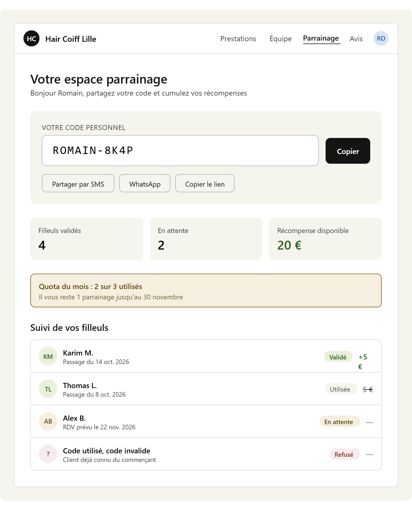

 fait moi exacemente comme cette amaquette quand le client est connu et connecté, 
 # 🎯 Page Parrainage côté client — reproduis exactement cette maquette

État visuel de la page `/parrainage` sur le site de réservation client,
**uniquement pour le client authentifié et connu**.

Tu connais le projet, tu fais à ta manière avec les patterns React / inline
styles / theme tokens déjà en place. La maquette HTML ci-dessous est la
**référence visuelle stricte** : mêmes blocs, même ordre, mêmes couleurs
sémantiques, mêmes libellés, mêmes proportions.

---

## Maquette — Client CONNECTÉ

```html
<div style="background: #f5f5f4; border-radius: 12px; padding: 1.5rem;">

  <!-- Header site client -->
  <div style="background: #fff; border-radius: 8px 8px 0 0; padding: 12px 16px; border: 0.5px solid rgba(0,0,0,0.15); display: flex; align-items: center; justify-content: space-between;">
    <div style="display: flex; align-items: center; gap: 10px;">
      <div style="width: 28px; height: 28px; border-radius: 50%; background: #111; display: flex; align-items: center; justify-content: center; color: #fff; font-size: 12px; font-weight: 500;">HC</div>
      <span style="font-size: 14px; font-weight: 500;">Hair Coiff Lille</span>
    </div>
    <div style="display: flex; align-items: center; gap: 16px; font-size: 13px; color: #666;">
      <span>Prestations</span>
      <span>Équipe</span>
      <span style="color: #111; font-weight: 500; border-bottom: 2px solid #111; padding-bottom: 2px;">Parrainage</span>
      <span>Avis</span>
      <div style="width: 26px; height: 26px; border-radius: 50%; background: rgba(59,130,246,0.1); display: flex; align-items: center; justify-content: center; color: #1e40af; font-size: 11px; font-weight: 500;">RO</div>
    </div>
  </div>

  <!-- Contenu page -->
  <div style="background: #fff; border: 0.5px solid rgba(0,0,0,0.15); border-top: none; border-radius: 0 0 8px 8px; padding: 1.75rem;">

    <!-- Salutation -->
    <div style="margin-bottom: 1.5rem;">
      <h1 style="font-size: 22px; font-weight: 500; margin: 0 0 4px;">Votre espace parrainage</h1>
      <p style="font-size: 13px; color: #666; margin: 0;">Bonjour Romain, partagez votre code et cumulez vos récompenses</p>
    </div>

    <!-- Code personnel -->
    <div style="background: #f5f5f4; border-radius: 12px; padding: 20px; margin-bottom: 1.5rem;">
      <p style="font-size: 12px; color: #666; margin: 0 0 8px; text-transform: uppercase; letter-spacing: 0.5px;">Votre code personnel</p>
      <div style="display: flex; align-items: center; gap: 12px; margin-bottom: 14px;">
        <div style="flex: 1; background: #fff; border: 0.5px solid rgba(0,0,0,0.3); border-radius: 8px; padding: 14px 18px; font-family: monospace; font-size: 20px; font-weight: 500; letter-spacing: 2px;">ROMAIN-8K4P</div>
        <button style="background: #111; color: #fff; border: none; padding: 14px 18px; border-radius: 8px; font-size: 13px; font-weight: 500; cursor: pointer; white-space: nowrap;">Copier</button>
      </div>
      <div style="display: flex; gap: 8px; flex-wrap: wrap;">
        <button style="background: transparent; border: 0.5px solid rgba(0,0,0,0.3); padding: 8px 14px; border-radius: 8px; font-size: 12px; cursor: pointer;">Partager par SMS</button>
        <button style="background: transparent; border: 0.5px solid rgba(0,0,0,0.3); padding: 8px 14px; border-radius: 8px; font-size: 12px; cursor: pointer;">WhatsApp</button>
        <button style="background: transparent; border: 0.5px solid rgba(0,0,0,0.3); padding: 8px 14px; border-radius: 8px; font-size: 12px; cursor: pointer;">Copier le lien</button>
      </div>
    </div>

    <!-- Stats -->
    <div style="display: grid; grid-template-columns: repeat(3, 1fr); gap: 12px; margin-bottom: 1.5rem;">
      <div style="background: #f5f5f4; border-radius: 8px; padding: 14px;">
        <p style="font-size: 12px; color: #666; margin: 0 0 4px;">Filleuls validés</p>
        <p style="font-size: 22px; font-weight: 500; margin: 0;">4</p>
      </div>
      <div style="background: #f5f5f4; border-radius: 8px; padding: 14px;">
        <p style="font-size: 12px; color: #666; margin: 0 0 4px;">En attente</p>
        <p style="font-size: 22px; font-weight: 500; margin: 0;">2</p>
      </div>
      <div style="background: #f5f5f4; border-radius: 8px; padding: 14px;">
        <p style="font-size: 12px; color: #666; margin: 0 0 4px;">Récompense disponible</p>
        <p style="font-size: 22px; font-weight: 500; margin: 0; color: #15803d;">20 €</p>
      </div>
    </div>

    <!-- Quota (affiché uniquement si une limite est configurée) -->
    <div style="background: rgba(251,191,36,0.12); border: 0.5px solid rgba(251,191,36,0.4); border-radius: 8px; padding: 12px 14px; margin-bottom: 1.5rem; display: flex; justify-content: space-between; align-items: center;">
      <div>
        <p style="font-size: 13px; color: #92400e; margin: 0; font-weight: 500;">Quota du mois : 2 sur 3 utilisés</p>
        <p style="font-size: 12px; color: #92400e; margin: 2px 0 0; opacity: 0.85;">Il vous reste 1 parrainage jusqu'au 30 novembre</p>
      </div>
    </div>

    <!-- Suivi filleuls -->
    <div>
      <h2 style="font-size: 16px; font-weight: 500; margin: 0 0 12px;">Suivi de vos filleuls</h2>
      <div style="border: 0.5px solid rgba(0,0,0,0.15); border-radius: 8px; overflow: hidden;">

        <!-- Statut : Validé (vert) -->
        <div style="display: flex; align-items: center; justify-content: space-between; padding: 12px 14px; border-bottom: 0.5px solid rgba(0,0,0,0.15);">
          <div style="display: flex; align-items: center; gap: 10px;">
            <div style="width: 32px; height: 32px; border-radius: 50%; background: rgba(34,197,94,0.15); color: #15803d; display: flex; align-items: center; justify-content: center; font-size: 11px; font-weight: 500;">KM</div>
            <div>
              <p style="font-size: 13px; font-weight: 500; margin: 0;">Karim M.</p>
              <p style="font-size: 11px; color: #666; margin: 0;">Passage du 14 oct. 2026</p>
            </div>
          </div>
          <div style="display: flex; align-items: center; gap: 10px;">
            <span style="background: rgba(34,197,94,0.15); color: #15803d; font-size: 11px; padding: 3px 8px; border-radius: 8px; font-weight: 500;">Validé</span>
            <span style="font-size: 13px; font-weight: 500; color: #15803d;">+5 €</span>
          </div>
        </div>

        <!-- Statut : Utilisée (gris, montant barré) -->
        <div style="display: flex; align-items: center; justify-content: space-between; padding: 12px 14px; border-bottom: 0.5px solid rgba(0,0,0,0.15);">
          <div style="display: flex; align-items: center; gap: 10px;">
            <div style="width: 32px; height: 32px; border-radius: 50%; background: rgba(34,197,94,0.15); color: #15803d; display: flex; align-items: center; justify-content: center; font-size: 11px; font-weight: 500;">TL</div>
            <div>
              <p style="font-size: 13px; font-weight: 500; margin: 0;">Thomas L.</p>
              <p style="font-size: 11px; color: #666; margin: 0;">Passage du 8 oct. 2026</p>
            </div>
          </div>
          <div style="display: flex; align-items: center; gap: 10px;">
            <span style="background: #f5f5f4; color: #666; font-size: 11px; padding: 3px 8px; border-radius: 8px;">Utilisée</span>
            <span style="font-size: 13px; color: #666; text-decoration: line-through;">5 €</span>
          </div>
        </div>

        <!-- Statut : En attente (orange) -->
        <div style="display: flex; align-items: center; justify-content: space-between; padding: 12px 14px; border-bottom: 0.5px solid rgba(0,0,0,0.15);">
          <div style="display: flex; align-items: center; gap: 10px;">
            <div style="width: 32px; height: 32px; border-radius: 50%; background: rgba(251,191,36,0.15); color: #92400e; display: flex; align-items: center; justify-content: center; font-size: 11px; font-weight: 500;">AB</div>
            <div>
              <p style="font-size: 13px; font-weight: 500; margin: 0;">Alex B.</p>
              <p style="font-size: 11px; color: #666; margin: 0;">RDV prévu le 22 nov. 2026</p>
            </div>
          </div>
          <div style="display: flex; align-items: center; gap: 10px;">
            <span style="background: rgba(251,191,36,0.15); color: #92400e; font-size: 11px; padding: 3px 8px; border-radius: 8px; font-weight: 500;">En attente</span>
            <span style="font-size: 13px; color: #999;">—</span>
          </div>
        </div>

        <!-- Statut : Refusé (rouge, anonymisé RGPD) -->
        <div style="display: flex; align-items: center; justify-content: space-between; padding: 12px 14px;">
          <div style="display: flex; align-items: center; gap: 10px;">
            <div style="width: 32px; height: 32px; border-radius: 50%; background: rgba(239,68,68,0.15); color: #991b1b; display: flex; align-items: center; justify-content: center; font-size: 11px; font-weight: 500;">?</div>
            <div>
              <p style="font-size: 13px; font-weight: 500; margin: 0;">Code utilisé, code invalide</p>
              <p style="font-size: 11px; color: #666; margin: 0;">Client déjà connu du commerçant</p>
            </div>
          </div>
          <div style="display: flex; align-items: center; gap: 10px;">
            <span style="background: rgba(239,68,68,0.15); color: #991b1b; font-size: 11px; padding: 3px 8px; border-radius: 8px; font-weight: 500;">Refusé</span>
            <span style="font-size: 13px; color: #999;">—</span>
          </div>
        </div>

      </div>
    </div>
  </div>
</div>
```

---

## Éléments dynamiques

- Nom du merchant (ici "Hair Coiff Lille")
- Prénom du client (salutation + initiales avatar + préfixe code personnel)
- Stats réelles (filleuls validés / en attente / montant disponible)
- Bandeau quota masqué si limite = illimitée
- Liste dynamique des filleuls avec 4 statuts possibles :
  `Validé` / `Utilisée` / `En attente` / `Refusé`

## Points importants

- Pas de Tailwind, inline styles React
- Adapter au dark mode via les theme tokens déjà en place dans le projet
- Apostrophes françaises → double-quotes en JSX (`{"l'offre..."}`)
- Responsive mobile : les grilles 3 colonnes passent en stack vertical